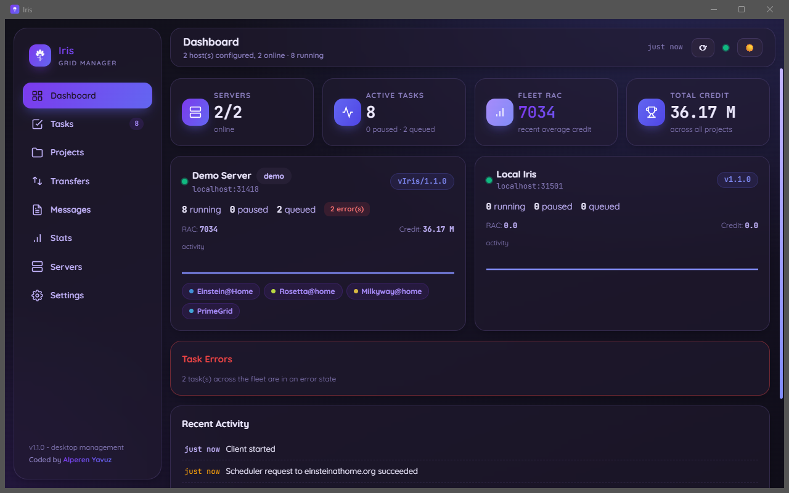

# Iris

[](https://github.com/alplix/iris/actions/workflows/ci.yml)
[](https://github.com/alplix/iris/releases)
[](LICENSE)

**Iris** is a volunteer-computing grid in one package: a small, dependency-free compute
**client** (`irisd`) and a native desktop **manager** (`iris`) that watches and controls every
machine in your fleet — local and remote — from one window.

<p align="center">
  
</p>

- **`irisd`, the client** — pure Go, one static binary, no runtime dependencies. Talks to
  BOINC-style project schedulers, transfers and verifies files, keeps GPU and CPU work apart, and
  exposes BOINC's GUI RPC protocol behind a password.
- **`iris`, the manager** — Go + [Wails](https://wails.io) (native WebView, no Electron). Tasks,
  projects, transfers, statistics, hardware, notifications, a project catalog, nine languages,
  light and dark themes. It speaks GUI RPC, so it can also monitor other BOINC-compatible clients.

> **Status — please read.** Iris is young. The manager is complete, and the client's plumbing
> (scheduler requests, file transfers, GUI RPC, credit and statistics, preferences, hardware
> detection) is implemented and tested. The client now covers the whole life of a task: it fetches
> work, downloads the application and inputs, **runs the project's real application** (on by default,
> unsandboxed — see below), **uploads the output files with the project's signed certificate and reports
> the result**. That whole path is tested end to end against a project double that follows BOINC's real
> wire formats (checked against BOINC's source), **but it has not yet been run against a live
> project's science application**, so whether a given project validates and credits the result is still
> unconfirmed. There is also no sandbox and no real GPU compute benchmark. See
> [Status and roadmap](#status-and-roadmap) for the honest list. Iris is in a test phase: try it, and
> tell us what a real project does with it.

- **Scheduler protocol**: builds scheduler requests with host information, reads the reply, records
  assigned results, reports finished ones, writes the project's credit and RAC back into its state
  and keeps a per-day credit history.
- **Robust transfers**: downloads have no whole-request timeout (large work files), a stall
  watchdog, cancellation, `.part` files that never look complete, and **MD5 verification** of every
  file that comes with a hash; a bad file is deleted, never executed.
- **Security**: every GUI RPC connection must complete BOINC's challenge–response handshake with a
  random 128-bit password (`gui_rpc_auth.cfg`, owner-only); nothing is answered before that.
- **Hardware detection** on Windows, Linux and macOS, on x86, ARM, RISC-V and POWER: CPU name and
  vendor (also from the device tree of single-board computers), RAM and disk without external
  tools, and GPUs with their **real VRAM** — driver-reported 64-bit values on Windows (not the
  4 GB-capped `AdapterRAM`), `nvidia-smi`, sysfs (amdgpu) and `system_profiler`. CPUs it does not
  recognise are **measured** at start-up instead of guessed.
- **Preferences**: `global_prefs_override.xml`; `max_ncpus` and `max_ncpus_pct` take effect
  immediately, the rest is stored and reported.
- **Operations**: real CPU benchmark on demand, live transfer list with abort/retry, daily transfer
  history, `--daemon` detaches and logs to `irisd.log`, `--stop` authenticates.

## Separate GPU and CPU work

Iris keeps GPU work and CPU work apart, each with its own disk share, so a large GPU work buffer can
never squeeze out CPU work and the other way round:

| | CPU work | GPU work |
|---|---|---|
| Slots (task working directories) | `slots/` | `slots_gpu/` |
| Project files (applications, data) | `projects/` | `projects_gpu/` |
| Download cache | `cache/` | `cache_gpu/` |
| Size limit (`cc_config.xml`) | `cpu_cache_size_mb` (default 4096) | `cache_size_mb` (default 2048) |

- A result is classed as GPU work from its plan class or command line (`cuda`, `opencl`, `gpu`).
- **The limits are enforced.** When one class has used its share, the client stops *starting*
  work of that class, logs it once in a while, and keeps starting the other class.
- With `separate_slots` / `separate_projects` set to `false` the two classes share directories, and
  then also one limit (the CPU one).
- `enabled` switches the limits off; a size of `0` means unlimited.
- The manager's **Stats → Disk usage** shows the space each project takes.

```xml
<cc_config>
  <options>
    <allow_remote_gui_rpc>1</allow_remote_gui_rpc>
  </options>
  <gpu_cache>
    <enabled>1</enabled>
    <cache_size_mb>2048</cache_size_mb>       <!-- GPU work: slots_gpu, projects_gpu, cache_gpu -->
    <cpu_cache_size_mb>4096</cpu_cache_size_mb> <!-- CPU work: slots, projects, cache -->
    <separate_slots>1</separate_slots>
    <separate_projects>1</separate_projects>
  </gpu_cache>
</cc_config>
```

> The separation covers *where work lives and how much room it gets*. Actually **fetching** GPU work
> from a project needs GPU information in the scheduler request — see
> [Status and roadmap](#status-and-roadmap): this is now implemented, with the same "no real
> benchmark, best-effort device selection" caveats as the experimental real-application execution
> above.

## AI Assistant

Iris can talk to [Tilvar AI](https://athena.org.tr), a small chat model, so people who would rather
ask a question in plain language than dig through menus — this was built with less technical BOINC
users especially in mind — still get a straight answer, and can still change things if they'd
rather say what they want than click through it.

- **Off by default.** Nothing is sent anywhere until you turn it on, from the Assistant page or from
  Settings.
- **Ask about your fleet**: "how many Einstein@Home tasks do I finish per day?", "which of my
  servers are offline?", "how much credit did I make this week?" — answered from your actual data.
- **Or tell it what to do**: pause or resume a project, switch run or network mode, run a benchmark,
  change preferences — on one server or on all of them. It always shows exactly what it's about to
  do and waits for you to tap **Confirm**; nothing runs on its own.
- **What's sent, and what never is**: each message — including server and project names, status,
  credit and recent task counts — goes to the Tilvar AI service to produce a reply. A password, RPC
  key or account key is never part of that conversation, and credential-bearing actions (adding a
  server, attaching a project) are out of the assistant's reach entirely, on purpose. Turning the
  assistant off clears the conversation.
- **Shared quota**: Tilvar AI is a small, rate-limited service shared by everyone using this
  feature, so a reply can occasionally be slow or need a retry.
- The in-app **Assistant** page has the full explanation (and the same privacy notes) in your own
  language, along with a few examples to try.

## Running next to BOINC

Iris is built to coexist with a stock BOINC client on the same machine. Nothing is shared:

| | Iris | BOINC |
|---|---|---|
| GUI RPC port | `31418` (`IRIS_GUI_RPC_PORT`; `31416` is refused) | `31416` |
| Client data | `%ProgramData%\Iris` / `~/.local/share/iris` / `~/Library/Application Support/Iris` | `%ProgramData%\BOINC` / `/var/lib/boinc-client` / `/Library/Application Support/BOINC Data` |
| Manager settings | `%APPDATA%\iris` / `~/.config/iris` | BOINC Manager's own |
| Programs | `iris`, `irisd` | `boincmgr`, `boinc` |
| Host identity on project servers | random ID stored in `host_cpid.txt`, per installation | BOINC's own |

Each client registers as its own host on a project, and no hardware identifier is sent. The one
thing the two cannot avoid sharing is the hardware: running both means both compute, so lower
`max_ncpus_pct` in Iris' preferences (or set one client to *never*) if you want to split the CPU.
The manager can also monitor BOINC clients — add them as a server on port `31416`.

## Platforms

| OS | Architectures | Packaging |
|---|---|---|
| Windows 10/11 | amd64, arm64 | NSIS installer + portable zip (WebView2 automatic) |
| macOS | amd64, arm64 | `.app` bundle (zip), with a menu bar tray icon |
| Linux | amd64, arm64 | portable `.tar.gz` (GTK3 + WebKitGTK 4.1 required) |

Every release bundles `irisd` alongside the manager. The manager auto-detects it (bundled copy
first, then the installed location) and registers it as **Local Iris**.

### Client-only platforms (32-bit, RISC-V, POWER)

The compute client `irisd` is pure Go with no native dependencies, so it also ships on its own for
machines that cannot run the desktop manager. Manage them from the manager on any other computer
(**Servers → Add Server**, port `31418`).

| Archive | For |
|---|---|
| `irisd-windows-386.zip` | 32-bit Windows |
| `irisd-linux-386.tar.gz` | 32-bit x86 Linux |
| `irisd-linux-armv7.tar.gz` | 32-bit ARM: Raspberry Pi 2/3/4/5 running a 32-bit OS, most ARM boards |
| `irisd-linux-armv6.tar.gz` | Raspberry Pi 1 / Zero |
| `irisd-linux-riscv64.tar.gz` | RISC-V (64-bit) boards and servers |
| `irisd-linux-ppc64le.tar.gz` | POWER8 and newer (little-endian) |
| `irisd-linux-ppc64.tar.gz` | big-endian 64-bit PowerPC / POWER |

The client's tests run on all of these in CI (through QEMU where the runner is x86-64). Two limits:

- **Work availability is up to each project.** A project only sends tasks for platforms it has
  applications for, and many projects have none for 32-bit ARM, RISC-V or POWER. Iris reports the
  standard BOINC platform name of the machine (`windows_x86_64`, `x86_64-pc-linux-gnu`,
  `riscv64-unknown-linux-gnu`, `powerpc64le-unknown-linux-gnu`, `arm-unknown-linux-gnueabihf`, ...).
- **32-bit PowerPC** (G3/G4/G5-era Macs and boards) is not supported: the Go toolchain has no
  32-bit PowerPC port.

## Install

> **Test phase.** Every release is currently published as a GitHub *pre-release*: Iris is being tested
> and is not ready for general use (see the status note at the top). The installers are also unsigned, so
> Windows and macOS will show a security warning.

Download the newest release from the [Releases page](https://github.com/alplix/iris/releases).

- **Windows** — run `iris-amd64-installer.exe` (or `iris-arm64-installer.exe` on ARM PCs). It installs
  the manager **and** the `irisd` client to `Program Files\alplix\Iris`, adds Start-menu and desktop
  shortcuts, offers to launch Iris when it finishes, and can be removed from *Apps & features*. The
  installer speaks the same nine languages as the app and picks the one matching your Windows
  language. Prefer no installer? Use the portable `iris-windows-*.zip`. The installer is not code
  signed yet, so SmartScreen may warn about an unknown publisher.
- **macOS** — unzip `iris-darwin-*.zip` and move `Iris.app` to Applications (unsigned: right-click →
  Open the first time).
- **Linux** — install `iris-amd64.deb` / `iris-arm64.deb` (Debian, Ubuntu and derivatives) or
  `iris-amd64.rpm` / `iris-arm64.rpm` (Fedora and derivatives); either pulls in GTK3 and WebKitGTK 4.1
  automatically and adds a menu entry. No package manager, or not on a Debian/Fedora-family distro?
  Run `iris-amd64.AppImage` / `iris-arm64.AppImage` directly (`chmod +x` first) — it bundles GTK3 and
  WebKitGTK itself. Prefer a plain folder? Extract `iris-linux-*.tar.gz` instead (GTK3 + WebKitGTK 4.1
  required, installed separately).

## Getting started

### 1. The client

You normally do nothing: the manager starts `irisd` for you. To run it yourself:

```
irisd            # run the compute client (foreground)
irisd --daemon   # same, detached (output goes to irisd.log in the data directory)
irisd --status   # show client status
irisd --stop     # stop the running client
```

The client keeps `client_state.xml`, `cc_config.xml`, `gui_rpc_auth.cfg`,
`global_prefs_override.xml`, `host_cpid.txt`, the project files and the slots in its data directory
— `%ProgramData%\Iris` (Windows), `~/Library/Application Support/Iris` (macOS) or `~/.local/share/iris`
(Linux) — and listens for management connections on **port 31418**.

Every GUI RPC connection has to authenticate: the first run generates a random password into
`gui_rpc_auth.cfg` (owner-readable only), and the client refuses any command before the
challenge–response handshake succeeds. Set `allow_remote_gui_rpc` to `0` in `cc_config.xml` to
listen on `127.0.0.1` only.

### 2. The manager

1. Launch **Iris**. It starts clean, like the BOINC manager: it finds the bundled `irisd`, adds it as
   **Local Iris** and starts it. Nothing else is added.
2. For a remote client, take the password from `gui_rpc_auth.cfg` in its data directory, then open
   **Servers → Add Server** and enter host, port (`31418`) and password.
3. Settings are stored in the OS config directory (`%APPDATA%\iris`, `~/.config/iris`,
   `~/Library/Application Support/iris`); host passwords live in `hosts.json` (0600).

### 3. Attach a project

**Projects → Add Project**, choose a server, then a project from the catalog (search, filter by
area; a green badge means the project has applications for that server's platform). Enter your
account key, or e-mail and password to look it up, and attach. Projects that are not on the list
can be entered by address.

### Folders and your own applications

Everything lives under the client's data folder (`C:\ProgramData\Iris` on Windows, `/var/lib/iris` or
`~/.local/share/iris` elsewhere). Each attached project has a readable folder under `projects/`, named
after its address as BOINC does (`einstein.phys.uwm.edu`, `asteroidsathome.net_boinc`); `slots/` holds one
numbered folder per running task, exactly like BOINC. Older versions named these folders after a hash;
they are renamed automatically on the next start and nothing in them is lost.

To run **your own build of a project's application** (BOINC's "anonymous platform"), put the
application files and an `app_info.xml` in that project's folder, then restart the client:

```xml
<app_info>
  <app><name>myapp</name></app>
  <file_info><name>myapp.exe</name><executable/></file_info>
  <app_version>
    <app_name>myapp</app_name>
    <version_num>105</version_num>
    <avg_ncpus>1</avg_ncpus>
    <cmdline>--fast</cmdline>
    <file_ref><file_name>myapp.exe</file_name><main_program/></file_ref>
    <!-- for a GPU build: <coproc><type>NVIDIA</type><count>1</count></coproc> -->
  </app_version>
</app_info>
```

Iris then tells the project its platform is `anonymous` and lists those applications, so the project only
sends work for them; the files are copied from the project folder into each task's slot and are never
downloaded. A problem in the file is explained in the event log. Tested against a project double and unit
tests, **not** yet against a live project that supports anonymous platform.

## Configuration

| Setting | Where | Effect |
|---|---|---|
| `IRIS_GUI_RPC_PORT` | environment | Port the client listens on and the manager expects (never BOINC's 31416) |
| `IRIS_INSTANCE_ID` | environment | Lets a second copy of the manager run next to an installed one |
| `IRIS_DEMO=1` | environment | Adds a simulated server (for development and screenshots) |
| `IRIS_TILVAR_API_KEY` | environment | Local/dev override for the [AI Assistant](#ai-assistant)'s API key; official builds bake it in at release time instead |
| `allow_remote_gui_rpc` | `cc_config.xml` | `0` = listen on `127.0.0.1` only |
| `gpu_cache` block | `cc_config.xml` | [Separate GPU and CPU work](#separate-gpu-and-cpu-work) |
| `max_ncpus`, `max_ncpus_pct` | Settings → Edit Global Prefs | How many tasks may run at once (applied live) |
| `real_apps_enabled` | Settings → Edit Global Prefs | Unsandboxed real application execution — see [Status and roadmap](#status-and-roadmap); on by default, `0` turns it off |

## Status and roadmap

Honest overview of what exists today.

**Implemented and tested**

- The manager and all of its pages; nine languages; installer and archives for six platforms plus the
  client-only builds; **.deb, .rpm and AppImage packages** for desktop Linux, built and verified in
  CI (the .deb/.rpm by actually installing them; the AppImage by checking its bundled binary resolves
  every shared library it needs, via `linuxdeploy` + its GTK plugin).
- GUI RPC server and client, including authentication; the manager against Iris's own client and
  against simulated data. (Talking to a stock BOINC client uses the same protocol but has had far less
  testing — reports welcome.)
- **Scheduler discovery**: the real scheduler address is scraped from a project's master page (the
  actual BOINC protocol), not guessed from the master URL — verified live against Einstein@Home.
- **Scheduler requests a real project accepts.** Up to and including v1.3.10 every request Iris sent
  to a real BOINC scheduler was rejected as malformed (`Error in request message: no end tag` — the
  request was one line of XML with no final newline, the client version was sent under the wrong tags,
  and the platform under `platform` instead of `platform_name`), so no real project ever sent any work.
  Found and fixed after a user's attached Einstein@Home and Amicable projects sat idle; now the request
  is line-per-element, uses the tags the reference client uses, stores the `hostid` the server assigns
  (so it does not register a new host at every contact), honors the server's `request_delay`, and learns
  a project's name from its reply. Verified against the live Einstein@Home and Amicable schedulers —
  with a deliberately invalid account key, so those tests only prove the request is now *accepted and
  understood* (`Invalid or missing account key`), not that work was received.
- Scheduler request/reply (with real work-fetch sizing, so a project is actually asked for work), file
  transfer with verification, credit/RAC and statistics, preferences, benchmark, hardware detection,
  GPU/CPU work areas with enforced limits.
- **Multi-project scheduling**: free task slots are divided across attached projects by resource share
  (BOINC's own default of 100 when unset) instead of a first-come FIFO that could starve one project
  behind another's deep queue. This is a simple, honest proportional split, not BOINC's own
  historical-debt algorithm — and there is not yet a settings page to configure a *different* share per
  project, so in practice every project is equally weighted today.
- The optional AI assistant (off by default): fleet Q&A and confirmation-gated control, backed by
  Tilvar AI. See [AI Assistant](#ai-assistant) above.
- **Running real BOINC applications (unsandboxed, on by default).** A scheduler reply's
  `<workunit>` (input files, command line) and `<app_version>` entries are parsed and matched to each
  task, the real executable they name is downloaded (and given the execute bit on Linux/macOS), every
  file is also made available under the logical name (`open_name`) the application opens it by, and a
  real `init_data.xml` is written into the slot before launch. Suspend/resume from the UI reaches an
  already-running task at the OS level (`SIGSTOP`/`SIGCONT`, or the Windows
  `NtSuspendProcess`/`NtResumeProcess` equivalent — each covered by a test that pauses and resumes a
  real, running process on its own OS). This is deliberately **not sandboxed**: a downloaded project
  binary runs with Iris's own privileges, the same trust model as the reference BOINC client, and there
  is no shared-memory channel to the app (so an app falls back to the BOINC API's own "standalone"
  behavior rather than getting live checkpoint/suspend callbacks through it). It can be switched off
  per host from Settings → a host's Global Preferences, where the risk is stated next to the switch. A
  task the client was interrupted in is queued again on the next start.
- **Returning results.** When a task exits cleanly, the output files its result declares are checked
  (missing or oversized ones fail the task with BOINC's own error numbers instead of pretending it
  succeeded) and uploaded with the same request the reference client makes: a `get_file_size` query
  so an interrupted upload resumes, then a `file_upload` carrying the project's signed certificate and
  the MD5, retried with a growing pause and across every listed upload address. Only after every
  output is uploaded is the result reported — with its final times, exit status, stderr and each output's
  `file_info` — and it is kept until the server's `result_ack` confirms it (a lost reply reports it
  again; a restart no longer throws finished work away). Covered by a test that runs the real
  scheduler and worker engines against a project double whose upload handler checks the certificate,
  size and MD5 as the real one does, and whose scheduler rejects a malformed report.
- **Energy and carbon counter.** The client estimates the electricity the work it runs uses and the
  CO2-equivalent that corresponds to, per day, and the manager's Statistics page shows totals, today,
  a CPU/GPU chart and a "km by car" comparison. It is an **estimate, not a meter**: only Iris's own running
  tasks are counted; the CPU is modelled from a full-load wattage (each running task keeps one logical
  core busy — default 65 W for the whole CPU), and an NVIDIA GPU is read from `nvidia-smi` while a GPU task
  runs (otherwise a configured figure, default 150 W, and the chart says so). Carbon uses a grid intensity
  (default 475 g CO2/kWh, roughly a world average). All three figures are set per host under Settings → a
  host's Global Preferences, and the carbon figures use the current grid number for the whole history.
  Idle power and other programs are not included, and a stock BOINC client cannot report it.
  To cut it, the same dialog has "use at most N% of CPU cores" and "do not use the GPU" (tasks already
  running finish first; a GPU that is switched off is also hidden from projects so none is offered). The
  Statistics page also draws a small scene of trees that wither as the CO2 you emit grows (each tree
  stands for the ~21 kg one tree absorbs in a year) — an illustration, not a measurement.
- **Requesting GPU work.** A detected NVIDIA or AMD GPU is now advertised in the scheduler request
  (`<coprocs>`, matching the reference client's own `lib/coproc.cpp` layout), so projects can actually
  offer GPU app_versions instead of never sending any. Two honest gaps remain, both because Iris has
  no CUDA/OpenCL driver bindings (`irisd` stays a dependency-free static binary): `peak_flops` is left
  unmeasured (0) rather than fabricated, so a project sizes GPU work using its own default estimate for
  the plan class instead of Iris's; and device selection always assumes a single GPU at index 0
  (`gpu_device_num` in `init_data.xml`, plus `CUDA_VISIBLE_DEVICES`/`GPU_DEVICE_ORDINAL`), so a
  multi-GPU host's extra devices sit idle. Covered by real application execution's same
  toggle above — GPU tasks are only ever downloaded and run while that is on.
- **A macOS menu bar tray icon.** `getlantern/systray` (used on Windows/Linux) and Wails both register
  their own Cocoa `NSApplicationDelegate` and crash if linked into the same binary, so macOS shipped
  with no tray at all until now. Fixed with a small native `NSStatusBar`/`NSStatusItem` package
  (`tray_objc_darwin.m`) that never touches `NSApp`'s delegate — it has nothing to collide with. Built
  and run on real Apple Silicon hardware to confirm it: AppKit's own logging shows the status item
  constructed and registered cleanly (`Created scene ... of class NSStatusItemScene`), no crash, no
  Objective-C duplicate-class warning, and the app kept running normally afterward.

**Not implemented yet**

- **Confirmation against a live project.** Everything above is verified against BOINC's published
  source and a strict project double, not against a real project's server and science application.
  Anything a real server does that the source does not show (validation rules, quirks) is untested.
- A settings page to actually configure a *different* resource share per project (today every project
  defaults to an equal 100 — see the multi-project scheduling note above), web-based preferences, proxy
  settings, account creation from the client.
- Code signing for the Windows/macOS installers — needs a certificate we don't have.

If one of these matters to you, open an issue — the order of the roadmap follows what people ask for.

## Building from source

Prerequisites:

- Go 1.26+
- [Wails CLI](https://wails.io/docs/gettingstarted/installation) (`go install github.com/wailsapp/wails/v2/cmd/wails@latest`)
- Node.js 20+ (frontend tooling)

On Linux you also need the [Wails WebKit/GTK dependencies](https://wails.io/docs/guides/linux)
(`libgtk-3-dev libwebkit2gtk-4.1-dev libayatana-appindicator3-dev`). On Windows, **WebView2** is
required at runtime (bundled by the installer).

```
wails dev        # live development build of the manager
wails build      # production build of the manager for the current platform
                 # (Linux with WebKitGTK 4.1: wails build -tags webkit2_41)
go build ./cmd/irisd   # build just the compute client
go test ./...          # tests (add -tags webkit2_41 on Linux)
```

Developer tools:

- `go run ./tools/uidev` serves the built frontend with simulated servers in a normal browser
  (`http://127.0.0.1:5188`), with an isolated settings directory.
- `tools/screenshots/tour.ps1` takes the README screenshots from a running copy of the app
  (see the header of the script).
- `go run build/gen_icon.go` regenerates every icon file; `go run internal/catalog/gen/main.go`
  refreshes the embedded project catalog.

Cross-compiling for release targets is handled by CI:

- `.github/workflows/ci.yml` — formatting, vet, tests, frontend build, a Linux smoke build, and the
  client's tests on 32-bit, ARM, RISC-V and POWER
- `.github/workflows/release.yml` — tagged releases (`vX.Y.Z`) for Windows, macOS and Linux plus the
  client-only builds, with checksums

## Architecture

```
cmd/irisd/                Iris compute client (the daemon)
main.go, tray*.go         Iris manager (Wails app entrypoints, system tray)
app.go                    Wails-bound API surface (main namespace)
tools/                    developer tools (uidev browser harness, screenshot tour)

frontend/                 Vite + vanilla JS/CSS single-page UI
  src/main.js             state, rendering, Wails bindings, notifications
  wailsjs/                generated TS bindings to the Go API

internal/                 shared Go packages
  app/                    manager logic (unit-tested): snapshots, polling, host ops
  boinc/                  BOINC GUI-RPC client (xmlrpc-over-TCP)
  cache/                  CPU/GPU work areas: separate slots, project files, cache, enforced limits
  catalog/                project catalog (BOINC's list, embedded snapshot, live server check)
  config/                 cc_config handling + data directory resolution
  detect/                 host hardware probe: CPU, RAM, disk, GPUs and VRAM, benchmark
  guirpc/                 GUI-RPC server the manager talks to (per-connection authentication)
  i18n/                   embedded UI translations, served to the frontend as `GetTranslations`
  local/                  local daemon detection & lifecycle management
  prefs/                  global_prefs_override.xml store and the limits derived from it
  product/                shared product identity (name, version, port)
  project/                project (account) management
  scheduler/              BOINC project scheduler client + engine
  state/                  client_state.xml model
  worker/                 task slot runner
  xml/                    XML helpers
```

The manager's Go API is bound under `window.go.main.App` and talks to the UI through plain method
calls plus a single event channel (`notice`) for deadline/error/offline notifications.

## Release checklist

1. Bump `product.Version` in `internal/product/product.go` and `productVersion` in `wails.json`.
2. `git tag v1.0.0 && git push origin v1.0.0`
3. Download the release assets; each job uploads `SHA256SUMS.txt` alongside the archives.

## License

MIT — see [LICENSE](LICENSE).
